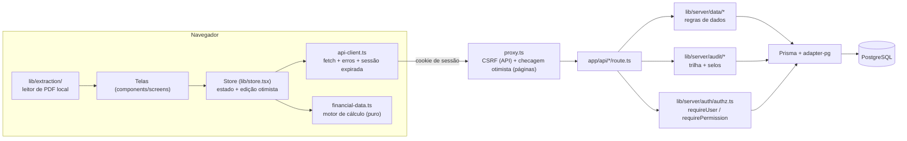
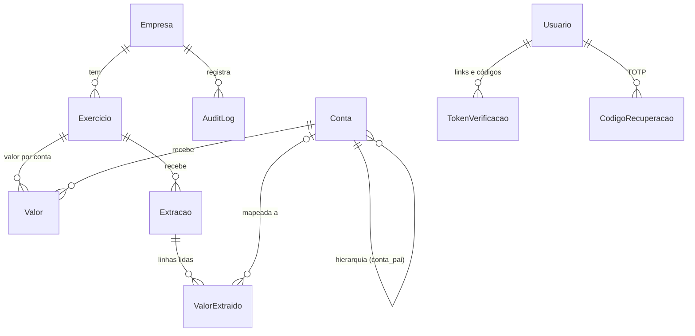
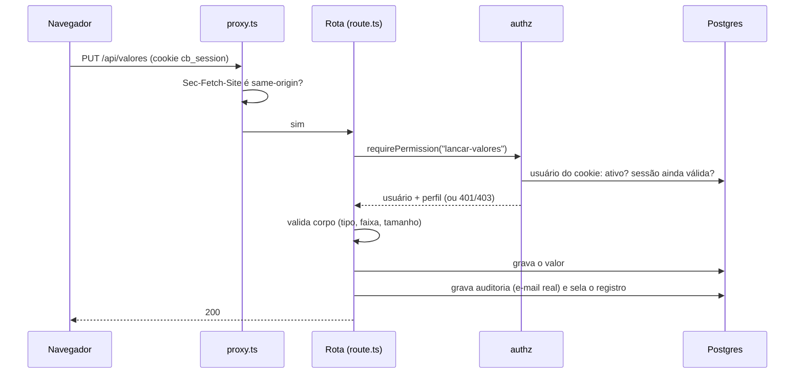

# Arquitetura

Visão de conjunto para quem vai ler o código pela primeira vez. Os diagramas usam Mermaid (a GitHub renderiza).
Segurança em detalhe: [`SECURITY.md`](../SECURITY.md). Operação: [`OPERACAO.md`](OPERACAO.md).

## 1. Camadas



- **Um só motor de cálculo.** Balanço, DRE, DFC e índices são calculados em `lib/financial-data.ts` (funções puras, sem
  estado, testadas com o modelo do TCC), e o **mesmo** código roda no navegador e nas rotas `/api/dre` e `/api/indices`.
  O banco guarda **valores** por conta e exercício, não totais: totais e índices saem sempre do motor, então tela,
  exportação CSV e parecer nunca divergem.
- **A defesa dos dados é do servidor.** Cada rota de `app/api/` chama `requirePermission()`/`requireUser()` (consulta o
  banco a cada requisição), valida a entrada (`lib/server/validation.ts`) e grava na trilha. O `proxy.ts` é só uma camada
  extra (não é a defesa): manda quem não tem cookie para `/login` e barra mutações de outra origem.
- **A tela edita no otimismo.** `lib/store.tsx` aplica a mudança na hora, envia por `PUT` (com espera de 600 ms e fila
  serial) e, se falhar, refaz a leitura do servidor. Sessão expirada (401) encerra uma vez só e leva ao login.
- **Sem estado no servidor** além do banco (a única exceção é o contador de tentativas de login, em memória — ver
  [`OPERACAO.md`](OPERACAO.md) §6).

## 2. Modelo de dados



- `Conta` cobre Balanço (`BP`), DRE e DFC pelo campo `tipo`; `ehGrupo` separa contas de agrupamento (sem valor próprio)
  das analíticas (recebem valores).
- `Valor` é único por (exercício, conta). `ValorExtraido` guarda **todas** as linhas que o leitor viu — inclusive as sem
  conta — com texto original, página e confiança (RF06); só as mapeadas viram `Valor`.
- `Usuario` nunca é apagado, só desativado (a trilha aponta para o e-mail de quem existiu).
- `AuditLog` tem `selo`/`selo_anterior` (integridade encadeada). `TokenVerificacao` guarda só hash/HMAC de links e códigos;
  `CodigoRecuperacao`, só HMAC.
- `PoliticaSeguranca` é uma linha por `Papel` (exigir 2 etapas), sem relação com `Usuario` — vale para todos do perfil.
- `LgpdErasureLog` fica de fora do desenho de propósito: sobrevive à eliminação da empresa que documenta.

## 3. Ciclo de uma requisição de escrita



## 4. Login com 2 etapas

```mermaid
sequenceDiagram
  participant B as Navegador
  participant L as /api/auth/login
  participant V as /api/auth/2fa/verificar
  B->>L: e-mail + senha
  L->>L: limite por e-mail/IP, scrypt em tempo constante
  alt sem 2 etapas
    L-->>B: cookie cb_session (httpOnly, Lax)
  else 2 etapas por e-mail
    L-->>B: {segundoFator, metodo: "email"} + cookie cb_2fa (Strict, 10 min)
    L->>B: código de 6 dígitos por e-mail
  else app autenticador ligado
    L-->>B: {segundoFator, metodo: "app"} + cookie cb_2fa
  end
  B->>V: código (do e-mail, do app ou de recuperação)
  V->>V: usuário vem do cookie cb_2fa, nunca do corpo; uso único; 5 tentativas
  V-->>B: cookie cb_session
```

- Acertar a senha **não cria sessão** quando há 2ª etapa: só o cookie temporário `cb_2fa` (assinado, `SameSite=Strict`).
- Com o app ligado, o código por e-mail deixa de ser aceito (e o reenvio é recusado): não há caminho mais fraco.
- Sessão: JWT (HS256) em cookie `httpOnly`; o servidor relê o usuário a cada requisição, então desativar alguém ou trocar a
  senha derruba a sessão na hora. Renovação deslizante a cada 4 h, teto de 24 h desde o login.

## 5. Perfis e permissões

A regra inteira está em [`lib/permissions.ts`](../lib/permissions.ts) (usada no servidor **e** na tela para esconder o que
não se pode fazer). Perfis cumulativos:

| Permissão | Analista | Coordenador | Administrador |
|---|:-:|:-:|:-:|
| consultar (inclui ver a auditoria); lançar valores e extrações | ✅ | ✅ | ✅ |
| gerir o Plano de Contas; editar a empresa | ❌ | ✅ | ✅ |
| marcar exercício como auditado; exportar e verificar a auditoria | ❌ | ✅ | ✅ |
| gerir usuários e a política de 2 etapas; LGPD (exportar/eliminar); selar à mão registros de auditoria pendentes | ❌ | ❌ | ✅ |

`app/api/authorization.test.ts` percorre **todas** as rotas: cada perfil abaixo do mínimo leva 403 e o mínimo passa; e um
teste estrutural falha se aparecer uma rota nova sem `requirePermission()`/`requireUser()` (fora de uma lista explícita de
rotas públicas).

## 6. Onde mexer para…

| Tarefa | Onde |
|---|---|
| Nova rota de API | `app/api/<nome>/route.ts` + `route.test.ts` ao lado; linha em `app/api/authorization.test.ts` |
| Nova permissão | `lib/permissions.ts` (`MIN_PAPEL`) e a matriz de `authorization.test.ts` |
| Mudar o banco | `prisma/schema.prisma` → `npx prisma migrate dev --name …` (migração **aditiva**; revise o SQL) |
| Novo índice financeiro | `lib/financial-data.ts` (`INDICATORS`) |
| Nova tela | `components/screens/` + item em `lib/navigation.ts` |
| Texto de e-mail | `lib/server/mail/mail-templates.ts` |

## 7. Decisões que valem lembrar

- **scrypt do Node** para senhas (sem dependência nativa; custo gravado no hash, dá para aumentar depois).
- **TOTP próprio com `node:crypto`** (RFC 6238, validado com os vetores oficiais): evita uma dependência para ~150 linhas.
- **Sessão sem tabela de sessões**: cookie assinado + `sessoes_validas_desde` no usuário. Encerrar "as outras" = mover essa data.
- **Falhar fechado**: sem `AUTH_SECRET`, sem SMTP com 2 etapas exigida, sem `APP_URL` em produção → o recurso recusa, nunca finge.
- **Trilha com selos** em vez de tabela imutável: o Postgres não impede um administrador de banco de editar; os selos tornam isso *detectável*.
- **Testes**: Vitest com Prisma simulado (rápido) **e** um teste de fumaça HTTP contra Postgres de verdade no CI — o primeiro
  não pega o que só o driver real revela (ex.: função `void` do Postgres), o segundo pega.
